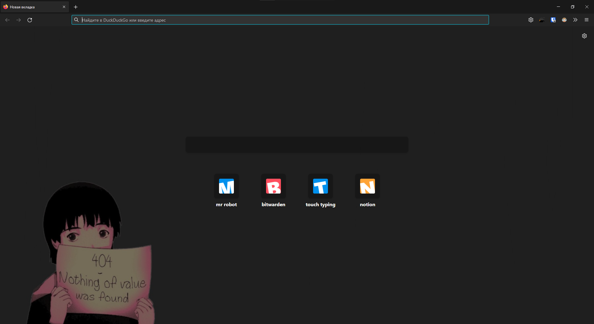
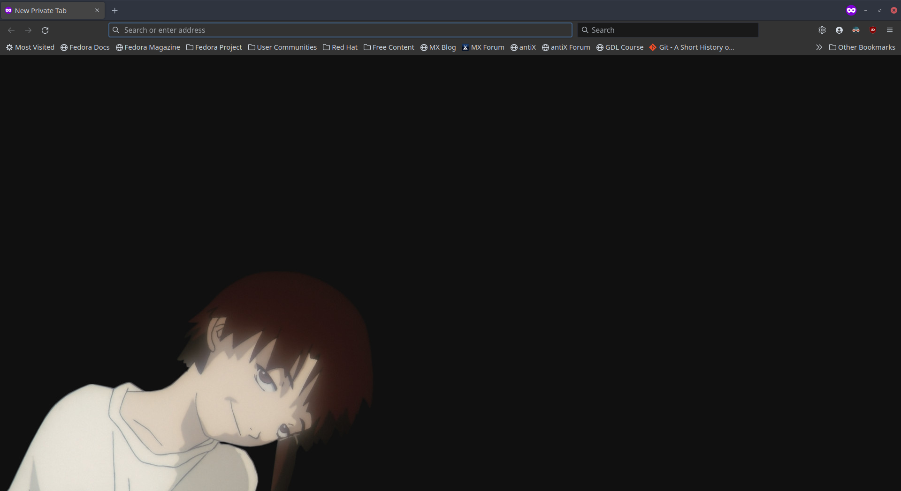

# preview:

## new tab

## new private tab

## guide:

1. go to *`about:config`* in your browser
2. change *`toolkit.legacyUserProfileCustomizations.stylesheets`* to `true`
3. create dir *`chrome`* and put theme files there
    * path on windows: *`C:\Users\\username\AppData\Roaming\Mozilla\Firefox\Profiles\\*release\chrome`*
    * path on linux: *`~/.mozilla/firefox/*release/chrome`*

[if something doesn't work out, watch this](https://youtu.be/BmchttxZ85w)
